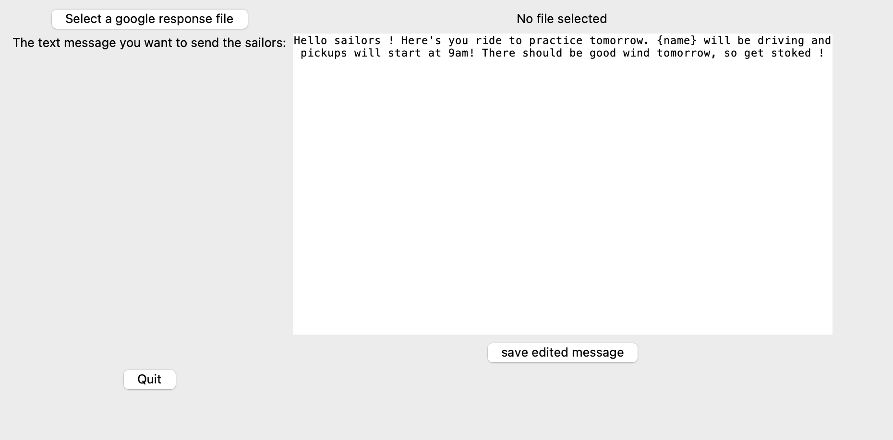
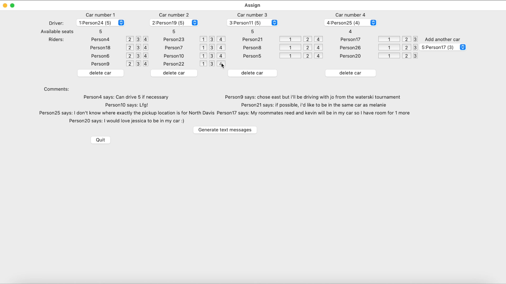

# Location-based Ride Share Assignments

While at UC Davis, I was a member of the Davis Sailing Team, where we regularly practiced at Lake Washington. Organizing carpool arrangements for the 20 km drive required a lot of manual effort. This project was used to streamline the process, significantly reducing the time needed for coordination.
 
## Start screen that lets you specify the message that should be sent out

Sign-ups are collected via a Google Form, and the associated Excel file must be loaded into the program. Additionally, the message sent to each carpool group can be customized here.

## Making custom changes to the assignment

The program matches riders with drivers based on their starting locations listed in the Google Sheet. Occasionally, manual adjustments are necessary due to comments or specific arrangements. The program allows users to add or remove cars and reassign riders between vehicles.
## Sending out the messages

For each car, riders' phone numbers are displayed for easy copying into a new iMessage chat, allowing car-specific details to be coordinated within the group.

## Installation
```bash
# Clone the repository
git clone https://github.com/anton325/carpool.git

# Navigate to the project directory
cd carpool

# Install the required Python packages
pip install -r requirements.txt

# Run the main
python gui.py
```